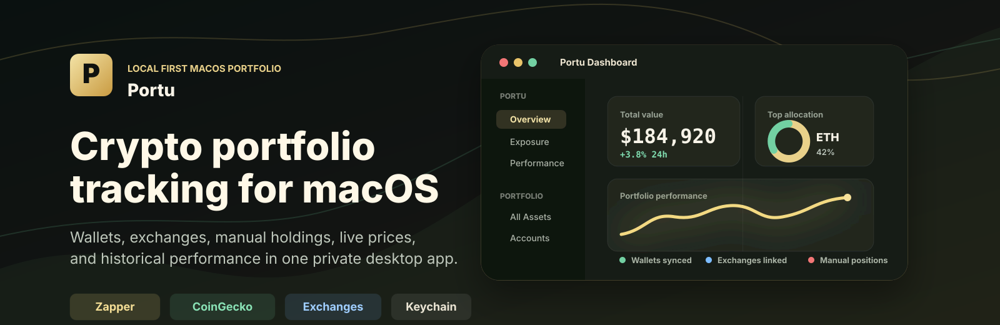

# Portu

Portu is a native macOS crypto portfolio dashboard for tracking wallets, exchanges, and manual holdings from one local app.

[Download latest release](https://github.com/Chalet-Labs/portu/releases/latest) | [All releases](https://github.com/Chalet-Labs/portu/releases) | [Report an issue](https://github.com/Chalet-Labs/portu/issues)

Portu is local-first. Portfolio data stays on your Mac, provider credentials are stored in Keychain, and the app has no backend and no telemetry.

## Features

- Unified overview with total portfolio value, 24h movement, allocation breakdowns, top assets, and a price watchlist.
- Wallet and DeFi position sync through Zerion for supported EVM networks, plus Solana token balances.
- Exchange accounts for Kraken, Coinbase, and Binance.
- Manual accounts for assets or positions that are not available from a provider.
- Exposure, performance, all-assets, all-positions, account, and asset-detail views.
- Live and historical pricing through CoinGecko, with Zerion fallback for onchain tokens that CoinGecko cannot price.
- Historical price backfill for local performance charts.
- Individual Zerion-wallet history and FIFO P&L analytics behind a local release gate.
- Token settings for CoinGecko ID overrides, pricing overrides, hidden dust, and unpriced assets.
- Custom RPC settings and configurable provider sync intervals.
- Authenticated in-app updates with Sparkle: privacy-preserving Ed25519 signature verification, Stable and Alpha release channels, and no background telemetry.

## Downloads

The easiest way to try Portu is from GitHub Releases:

- [Latest release](https://github.com/Chalet-Labs/portu/releases/latest)
- [All releases](https://github.com/Chalet-Labs/portu/releases)

Release builds publish a `Portu-<version>.dmg` plus a SHA-256 checksum. The release workflow is driven by semantic-release from the `master` and `alpha` branches.

## Updates

Portu includes authenticated, privacy-preserving in-app updates powered by Sparkle with Ed25519 signature verification:

- **Channels**: Choose between **Stable** (default) and **Alpha** release channels in `Settings > General`.
- **Privacy & Control**: Update checks send no analytics or system profiling, require explicit consent, and never download or restart automatically.
- **Manual Bootstrap**: Existing installations on legacy pre-updater builds must perform a one-time manual install from [GitHub Releases](https://github.com/Chalet-Labs/portu/releases/latest) to bootstrap in-app updates. All subsequent compatible releases update seamlessly within the app.

## API Keys

Users need a personal Zerion API key for wallet and DeFi sync. Create one at [dashboard.zerion.io](https://dashboard.zerion.io/), then add it in Portu under `Settings > API Keys > Zerion`.

Zerion coverage is intentionally bounded: Bitcoin, Moonbeam, Immutable X, and Hyperliquid wallet sync are not available, and Solana DeFi positions are not supported. Existing cached data is retained when a legacy account cannot be migrated.

Optional credentials:

- CoinGecko API key: raises price API rate limits.
- Exchange API keys: required only for Kraken, Coinbase, or Binance exchange accounts.

Use read-only exchange API credentials where the exchange supports them. Portu stores provider secrets locally in macOS Keychain.
Wallet addresses are sent directly from the app to the configured portfolio and pricing providers; Portu has no proxy or backend that receives them.

### Experimental Zerion analytics

Portu can augment an individual Zerion account with provider wallet-value history and a separate FIFO P&L summary. The existing snapshot-delta chart is labeled **Value Change** because deposits, withdrawals, and transfers affect it; it is not cost-basis P&L.

Analytics are local-only and off by default during rollout. Developers can opt in for testing with `PORTU_ZERION_ANALYTICS=1`. Authenticated smoke tests confirmed the endpoints with a Zerion demo-tier key, but effective quotas remain specific to each user's BYOK plan. Portu stores only normalized daily values and P&L fields, retains at most 400 days of provider history, and never stores raw API bodies or authorization headers.

Wallet history may omit unsupported historical DeFi positions. Zerion P&L can exclude unpriced assets, uses FIFO, values unrealized gains with current prices, and can misclassify some airdrops. It is an estimate, not tax advice. Multiple same-family wallet addresses are shown separately and are never added into a fabricated combined P&L total.

## Getting Started

1. Download the latest DMG from [Releases](https://github.com/Chalet-Labs/portu/releases/latest).
2. Open Portu and go to `Settings > API Keys`.
3. Add your Zerion API key from [dashboard.zerion.io](https://dashboard.zerion.io/).
4. Add a wallet, exchange, or manual account from the Accounts view.
5. Sync the account and use Overview, Exposure, Performance, All Assets, and All Positions to inspect the portfolio.

## Build From Source

Requirements:

- macOS 15 or newer
- Xcode with Swift 6.2 support
- [XcodeGen](https://github.com/yonaskolb/XcodeGen)
- [just](https://github.com/casey/just)

Common commands:

```bash
just generate
just build
just test-packages
just test
```

For a full local build, launch, and process verification:

```bash
./script/build_and_run.sh --verify
```

## Architecture

Portu is generated from `project.yml` and split into three SwiftPM packages:

- `PortuCore`: models, DTOs, Keychain access, local storage protocols, and shared domain types.
- `PortuNetwork`: Zerion, CoinGecko, Kraken, Coinbase, and Binance provider clients.
- `PortuUI`: shared SwiftUI theme and reusable UI components.

The macOS app target in `Sources/Portu` owns app state, feature views, settings, and sync orchestration.
